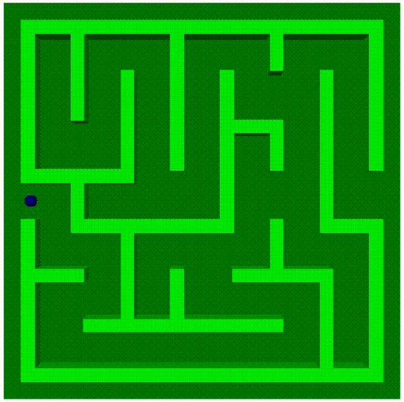
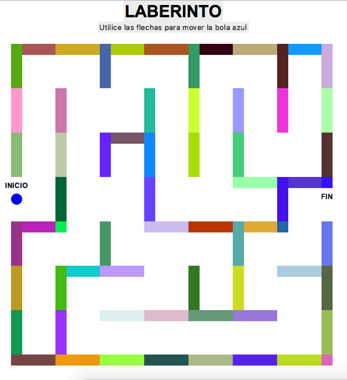

# Maze-Game
Python-based GUI 3D and 2D maze games. The games reacts to the user action with the arrows in the keyboard. In the 3D version, the board moves to generate the movement of the ball.

### 3D

### 2D

